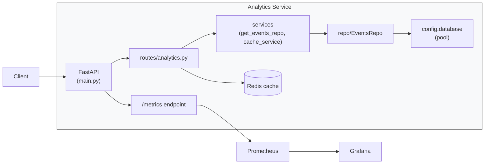

# Analytics Service

This service exposes analytics endpoints for events ingested into the platform.

Contents
- Overview and architecture
- Code layout and component responsibilities
- Data / request flow
- Patterns and concepts used
- How to run locally (dev)
- Observability and monitoring (Prometheus + Grafana)
- Next steps and improvements

## Overview

The Analytics Service is a FastAPI application that provides HTTP endpoints
to query aggregated analytics about events (counts, top events, active users,
user event history). The service uses a PostgreSQL database for persistent
storage and Redis for short-lived caching of expensive query results.

Key features
- Synchronous Postgres access using psycopg2 with a pooled `SimpleConnectionPool`.
- Repository pattern (`EventsRepo`) encapsulating SQL queries.
- FastAPI dependency injection to provide per-request repository instances.
- A decorator (`with_cursor`) that wraps repository calls with cursor lifecycle
  management so repository methods only contain query logic.
- Redis caching for hot queries.
- Prometheus metrics endpoint and basic metrics (custom counters + process/gc).
- OpenTelemetry instrumentation (optional) wired in application lifespan.

## Project layout

- `main.py` - FastAPI app, lifespan, instrumentation, router registration.
- `routes/analytics.py` - HTTP endpoints for analytics queries.
- `routes/metrics.py` - Prometheus-compatible `/metrics` endpoint.
- `config/` - Configuration and database pool helpers (`config/database.py`).
- `repo/events.py` - `EventsRepo` containing SQL query methods.
- `services/` - App-level services and FastAPI dependency providers (e.g. `get_events_repo`).
- `services/cache_service.py` - async Redis helpers for caching.
- `common/decorators.py` - `with_cursor` decorator that manages cursor lifecycle.
- `utils/` - misc utilities (e.g., `postgres.py` helper wrappers, if present).

## Data / request flow

1. Client calls an endpoint e.g. `GET /analytics/top-events?limit=5`.
2. FastAPI routes are defined in `routes/analytics.py`. The route declares
   a dependency `repo: EventsRepo = Depends(get_events_repo)`.
3. `get_events_repo` (in `services/`) obtains a connection from the configured
   pool (`config.database.get_connection()`), creates an `EventsRepo(conn)` and
   yields it for the request scope.
4. Route handler calls a repository method such as `repo.get_top_events(limit)`.
5. `EventsRepo` methods are decorated with `@with_cursor(...)`. The decorator
   creates a DB cursor (using the bound connection or a pooled connection if
   none exists), exposes it as `self._cur` and the method executes SQL and
   maps results.
6. Optionally, results are cached in Redis via `services.cache_service`.
7. Route returns a JSON response. Prometheus metrics are collected via the
   `/metrics` endpoint.

## Patterns and concepts used

- Repository pattern: separates SQL and mapping from HTTP layer.
- Dependency Injection: FastAPI `Depends` provides per-request repo bound to
  a pooled connection.
- Connection pooling: `psycopg2.pool.SimpleConnectionPool` to reuse DB
  connections and reduce overhead.
- Cursor decorator: keeps repository method bodies focused on queries and
  mapping, while cursor acquisition/cleanup is centralized.
- Caching: Redis is used to cache expensive queries with TTLs.
- Observability: Prometheus metrics (via `/metrics`) and OTEL instrumentation
  can be enabled for traces/metrics export.

## Architecture diagram

Below is a Mermaid diagram that shows the high-level architecture and the
runtime flow between components. If your Markdown renderer doesn't support
Mermaid, an ASCII fallback is provided underneath.

