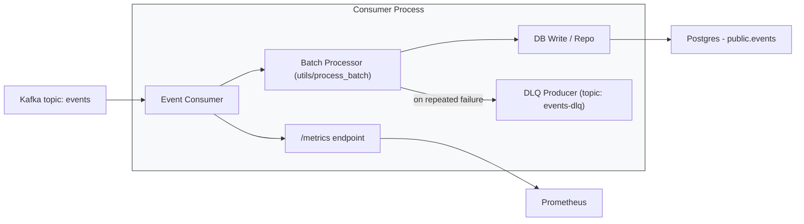

# Event Consumer

The Event Consumer reads raw events from Kafka, performs normalization/validation and writes normalized records into Postgres. It also implements batching, retries, and a dead-letter queue (DLQ) strategy for failed batches.

## Responsibilities
1. Consume messages from the configured Kafka topic.
2. Batch messages to improve write throughput and reduce DB load.
3. Normalize and validate payloads using `utils/process_batch`.
4. Persist events to Postgres via the connection provider in `config`.
5. On repeated failures, publish problematic messages to a DLQ Kafka topic.
6. Expose Prometheus metrics for consumer health and lag.

## Project layout

1. `main.py` — bootstrap, Kafka consumer creation, batching loop, retry + DLQ logic.
2. `config/` — configuration loader and helpers for Kafka and database connections.
3. `utils/batch_processor.py` (or `utils/process_batch`) — batch processing and DB write logic.
4. `repo/` (if present) — persistence helpers that encapsulate SQL / DB operations.
5. `Dockerfile` — container image used by Docker Compose.

## Data / processing flow
1. Kafka consumer created via create_consumer(settings) (config in config/config.py).
2. Messages are read in an event loop and appended to an in-memory batch.
3. When batch_size or batch_timeout is exceeded, the consumer calls process_batch(batch, get_conn).
4. process_batch normalizes events and writes them to Postgres using a fresh connection from get_conn().
5. If processing fails, the consumer retries up to 3 times with exponential backoff; on final failure it publishes each failed message to KAFKA_TOPIC-dlq using the DLQ producer.
6. Metrics (e.g., consumer_lag_total) are incremented as messages are consumed so Prometheus can monitor consumer throughput and lag.

## Configuration
Configuration is provided via the central `config` module and environment variables. Key settings include:

1. `KAFKA_SERVER`, `KAFKA_TOPIC`, `GROUP_ID` — Kafka connection and topic
2. `POSTGRES_HOST`, `POSTGRES_DB`, `POSTGRES_USER`, `POSTGRES_PASSWORD` — Postgres connection
3. `BATCH_SIZE`, `BATCH_TIMEOUT` — batching behavior
4. `METRICS_PORT` — Prometheus metrics port for this process

## Observability

1. Prometheus: the consumer exposes basic counters (e.g., `consumer_lag_total`) via the `prometheus_client` library.
2. Logs: use structured logs (configured in `main.py`). Look for messages about batch retries and DLQ publishing.
3. Tracing: OpenTelemetry is initialized (`init_tracer`) if the collector endpoint is configured.

## Failure handling and DLQ

1. Processing is retried with exponential backoff (2^attempt seconds).
2. On final failure messages are published to `<KAFKA_TOPIC>-dlq` so they can be inspected and reprocessed.

## Architecture diagram

Below is a Mermaid diagram that illustrates the Event Consumer runtime flow.

