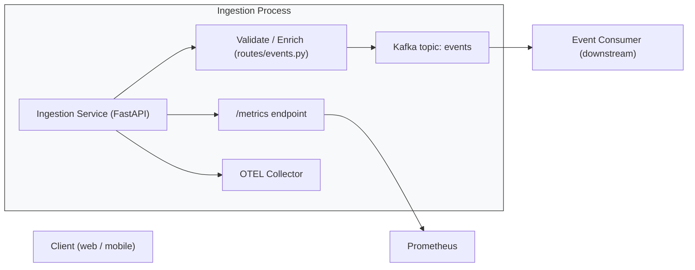

# Ingestion Service

The Ingestion Service is a lightweight FastAPI HTTP endpoint responsible for accepting raw events from clients and publishing them to the Kafka topic used by the rest of the platform. It performs basic validation and enrichment, and delegates reliable delivery to Kafka.

## Responsibilities
1. Expose POST /events endpoint to accept incoming event payloads.
2. Validate and normalize incoming payloads (basic schema checks).
3. Publish events to the configured Kafka topic using an async producer (aiokafka).
4. Expose Prometheus metrics (/metrics) and optional OpenTelemetry tracing.

## Project layout

1. `main.py` — FastAPI app, lifespan setup (OTEL), Kafka producer initialization, router registration.
2. `routes/events.py` — HTTP endpoints for receiving events and health/metrics.
3. `services/kafka_service.py` — singleton wrapper around AIOKafkaProducer with `send_event_to_kafka` helper.
4. `config/` — configuration loader (Kafka settings, Postgres URL for downstream components, OTEL endpoint).
5. `Dockerfile` — container image build for Docker Compose.

## Request flow
1. Client POSTs JSON to ⁠ /events ⁠ (e.g., { user_id, event_name, metadata, timestamp }).
2. The ⁠ events ⁠ route performs lightweight validation and may enrich the payload (e.g., add server timestamp).
3. The route uses the global Kafka producer (initialized in the app lifespan) to call ⁠ kafka_service.send_event_to_kafka(payload) ⁠.
4. ⁠The route returns an HTTP 202 (Accepted) on successful enqueue or an appropriate 4xx/5xx on failure.
5. ⁠Metrics and traces (if enabled) capture request counts, latencies and producer errors.

## Configuration
Environment variables drive configuration via ⁠ config/config.py ⁠:

1. KAFKA_SERVER ⁠, ⁠ KAFKA_TOPIC ⁠ — Kafka bootstrap server and topic name
2. SERVICE_NAME ⁠ — used for tracing
3. OTEL_EXPORTER_OTLP_ENDPOINT ⁠ — optional OpenTelemetry collector endpoint
4. METRICS_PORT ⁠ — Prometheus metrics port

## Observability
1. ⁠Metrics: ⁠ /metrics ⁠ endpoint exports Prometheus metrics via ⁠ prometheus_client ⁠.
2. Tracing: the app attempts to initialize OpenTelemetry in its lifespan; traces are exported to the configured OTEL collector.
3. ⁠Logs: check application logs for producer errors or validation failures.

## Reliability & delivery
1. The service uses ⁠ AIOKafkaProducer.send_and_wait ⁠ to publish messages; this awaits broker acknowledgment for each send.
2. For higher throughput, consider buffering on the client or batching before sending to Kafka.
3. Implement schema validation (Pydantic models) to provide consistent event shapes.

## Architecture diagram

Below is a Mermaid diagram showing the Ingestion Service runtime flow. If Mermaid is not rendered by your Markdown viewer, an ASCII fallback is included.

# Event Ingestion Service

This service provides an HTTP API for ingesting events into the event processing platform.

## Features
1. REST API for event ingestion (POST /events)
2. ⁠Async Kafka producer for high-throughput event publishing
3. ⁠Pydantic validation for event data
4. OpenTelemetry tracing integration
5. Prometheus metrics export
6. Comprehensive error handling and logging

## API Endpoints

### POST /events
Accepts event data and publishes to Kafka.

*Request Body:*
⁠ json
{
  "user_id": "string",
  "event_name": "string",
  "metadata": {},
  "timestamp": "2023-01-01T00:00:00Z"
}
 ⁠

*Response:*
⁠ json
{
  "status": "accepted",
  "event_id": "string"
}
 ⁠

### GET /metrics
Exposes Prometheus metrics.

## Configuration

Environment variables:
1. KAFKA_TOPIC ⁠: Kafka topic name (default: "events")
2. KAFKA_SERVER ⁠: Kafka broker address (default: "kafka:9092")
3. METRICS_PORT ⁠: Port for metrics server (default: 8001)
4. OTEL_EXPORTER_OTLP_ENDPOINT ⁠: OpenTelemetry collector endpoint

